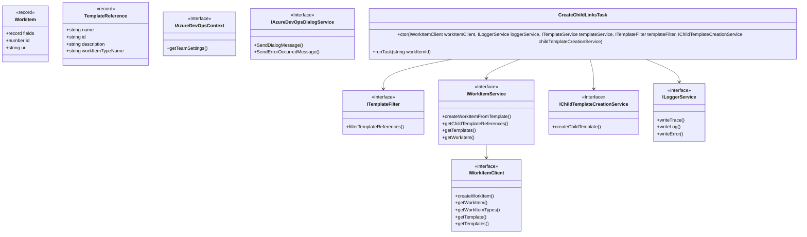
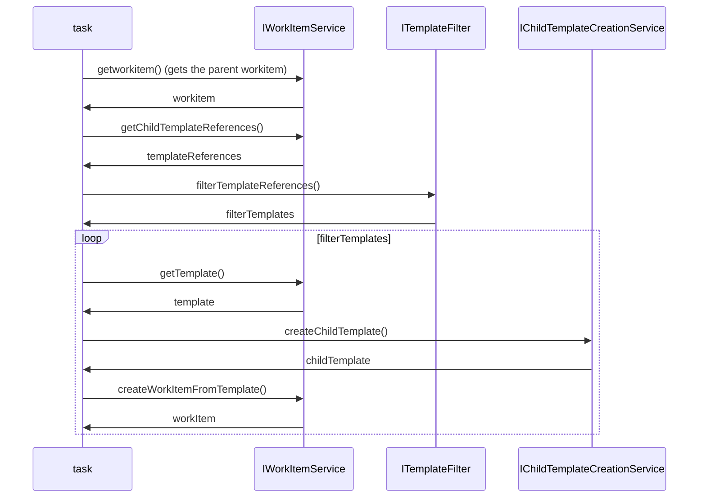

# Create Child Links Task

## Overview

The purpose of this task is to create child tasks based on the templates that are provided by the user's team. The task will create a new task for each template that is provided by the user. The task will also set the parent-child relationship between the parent and the child.

## Inputs

- `workItemIds` (number[]): The workItem Id(s) for the parent items selected by the user.

## Outputs

- `success`: A message is displayed to the user if the child tasks are created successfully.
- `errorMessage`: A message is displayed to the user to indicate that the child tasks could not be created and to check the logs for more information.

## Class Diagrams

## Sequence Diagram

