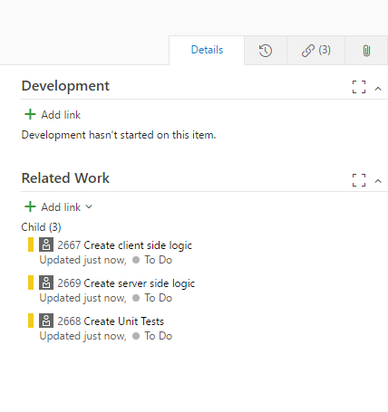

## 1-Click Child-Links ##

<a href="https://marketplace.visualstudio.com/items?itemName=ruifig.vsts-work-item-one-click-child-links" target="_blank">1-Click Child-Links</a> is an Azure DevOps extension for creating multiple work items as children via single click, where each work item is based on a single pre-defined template.

Azure DevOps offers team-specific work item templating as <a href="https://docs.microsoft.com/en-us/azure/devops/boards/backlogs/work-item-template?view=azure-devops&tabs=browser" target="_blank">core functionality</a> with which you can quickly apply pre-populated values for your team's commonly used fields per work item type.

The child work items created by this extension are based on the Filter values given by the user in the template.

It's also possible to limit which parent work items apply to each template in one of two ways:

Simplified: put the list of applicable parent work item types in the child template's description field, like this: `[Product Backlog Item,Defect]`

Complex: put a minified (single line) JSON string into the child template's description field, like this:

``` json
{
    "applywhen":
    {
        "System.State": "Approved",
        "System.Tags" : ["Blah", "ClickMe"],
        "System.WorkItemType": "Product Backlog Item"
    }
}
```

### Define team templates ###

<a href="https://docs.microsoft.com/en-us/azure/devops/boards/backlogs/work-item-template?view=azure-devops&tabs=browser#manage" target="_blank">Manage work item templates</a>


### Create / open a work item ###

Find 1-Click Child-Links on toolbar menu


### Done ###

You should now have children associated with the open work item.



## Release notes ##

* v1.0.0
  * Refactored to TypeScript
  * Added support for simple dialog to inform user of success or failure
  * various package updates and bug fixes

* v0.13.1
  * Added support for tags to be applied to child work items

* v0.13.0
  * simplified the field replacement logic

* v0.12.1
  * first Clark EPT release of the extension Forked from https://github.com/figueiredorui/1-click-child-links

## Usage ##

1. Clone the repository
1. `yarn` to install required local dependencies
1. `yarn build` to build the production version of the extension (`yarn build:dev` for development version)
1. `yarn package` to package the extension
1. Upload the extension to your Azure DevOps organization

## Credits ##

Clone from https://github.com/cschleiden/vsts-extension-ts-seed-simple